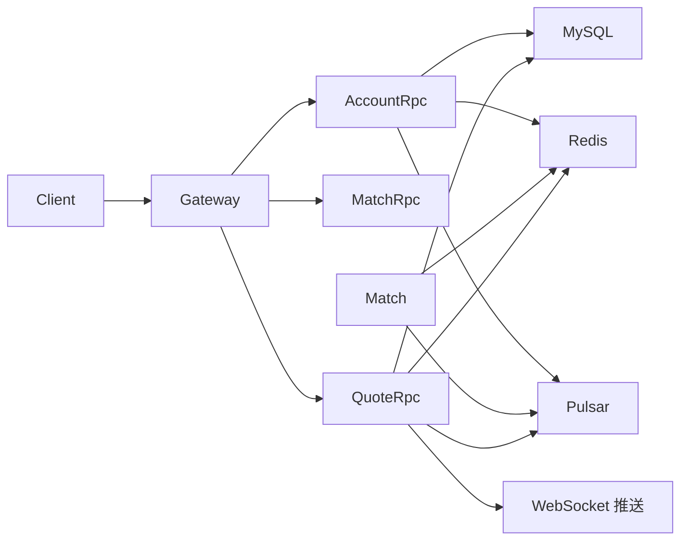
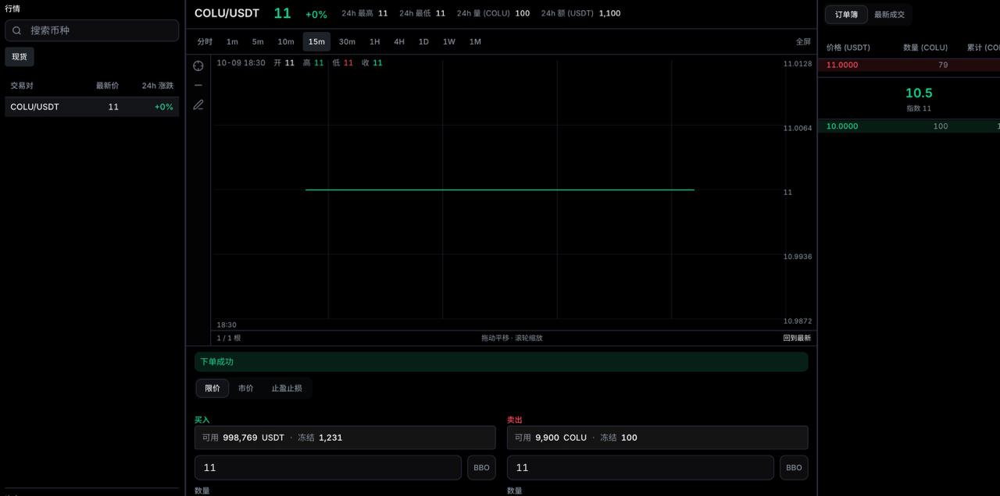

# go 微服务实践 — 基于 go-zero 的数字货币现货交易平台

- 后端：[https://github.com/nmg988rbdv-svg/go-zero_columbina](https://github.com/nmg988rbdv-svg/go-zero_columbina)
- 前端：[https://github.com/nmg988rbdv-svg/go-zero_columbina-ui](https://github.com/nmg988rbdv-svg/go-zero_columbina-ui)

基于 go-zero 实现现货交易核心能力：

- 限价单、市价单撮合
- 行情（盘口、K 线、Tick、Ticker）与个人订单变更的实时推送

## AI 重构概览

## 架构说明

相较早期多 API / 多 RPC 拆分，当前仓库已**合并大量服务**，核心只保留四个进程：


| 服务              | 目录                | 说明                                           |
| --------------- | ----------------- | -------------------------------------------- |
| **Gateway**     | `app/gateway`     | 统一 HTTP 入口，聚合账户、订单、行情、盘口接口                   |
| **Account RPC** | `app/account/rpc` | 用户认证、资产（Redis）、订单与成交归档（MySQL）              |
| **Match**       | `app/match`       | 撮合引擎，消费 Pulsar 订单流，盘口与快照存 Redis              |
| **Quote RPC**   | `app/quote/rpc`   | K 线 / Tick / Ticker，持久化 MySQL，推送 WebSocket |





## 中间件依赖

核心链路依赖：

- **MySQL**（`mysql:8.4`）：用户、订单终态、成交记录、K 线、Tick 等
- **Redis**：用户资产、会话、撮合盘口与快照、行情缓存
- **Apache Pulsar**：订单与撮合结果消息
- **etcd**：RPC 服务注册发现
- **WebSocket**（`deploy/depend/ws`）：行情与订单推送

本地开发使用 `app/*/etc/*.yaml` 或 `*.dev.yaml`，连接 Docker 依赖的**宿主机映射端口**（Etcd `12379`、Pulsar `16650`、Redis `16379`、MySQL `13306`）。容器部署使用 `*.prod.yaml`（服务名 + 容器内默认端口）。

> **说明**：基础设施见 `deploy/depend/docker-compose.yaml`，MySQL 使用官方 `mysql:8.4` 镜像；首次启动会执行 `deploy/depend/mysql/init/001-schema.sql`。业务账号为 `columbina/columbina`，数据库为 `trade`，宿主机端口为 `13306`。

## 基本功能

### 限价单



### 市价单


## 部署

推荐使用 Docker Compose 分两步启动：**先基础设施，再业务服务**。对应 Makefile 中的 `dep` 与 `start` 两个目标。

### 前置要求

- Docker 与 Docker Compose
- Make（Linux / macOS / WSL 环境；Windows 建议使用 WSL 或 Git Bash）
- Go 1.24+（`make start` 会在宿主机交叉编译 Linux 二进制）

### 1. 启动基础设施

```shell
make dep
```

该命令会：

- 创建 Docker 网络 `columbina`（若不存在）
- 启动 `deploy/depend/docker-compose.yaml` 中的中间件：MySQL、Redis、Pulsar、Etcd、Nginx、WebSocket 等
- 自动执行 MySQL 初始化、Pulsar Topic 创建、Redis 测试账户资产写入

宿主机映射端口见上文「中间件依赖」；Nginx 监听 `80`，MySQL `13306`，Redis `16379`，Pulsar `16650`，Etcd `12379`。

### 2. 编译并启动业务服务

```shell
make start
```

该命令会：

- 交叉编译 `gateway`、`accountrpc`、`match`、`quoterpc` 四个服务到 `bin/`
- 构建镜像并启动 `deploy/dockerfiles/docker-compose.yaml` 中的业务容器

| 服务 | 容器名 | 端口 |
| --- | --- | --- |
| Gateway | `columbina-gateway` | 8888 |
| Account RPC | `columbina-accountrpc` | 20002 |
| Match | `columbina-match` | 20003 |
| Quote RPC | `columbina-quoterpc` | 20011 |

容器内配置使用 `app/*/etc/*.prod.yaml`（中间件地址为 `columbina-etcd`、`columbina-redis` 等 Docker 服务名）。

### 3. 访问与验证

- HTTP API：Gateway `http://localhost:8888`，或通过 Nginx `http://localhost`
- WebSocket 推送：`deploy/depend/ws`（Proxy `20067`，Socket `19992`）
- 清理容器与数据：`make clean`

更多细节见 [deploy/README.md](deploy/README.md)。

## 运行项目（本地开发）

### 1. 代码生成与编译

```shell
# 生成 Gateway 代码（修改 .api 后）
make gapi

# 生成 Account / Quote RPC（修改 .proto 后）
make accountrpc
make quoterpc

# 编译各服务二进制
go build -o bin/gateway ./app/gateway
go build -o bin/accountrpc ./app/account/rpc
go build -o bin/match ./app/match
go build -o bin/quoterpc ./app/quote/rpc
```

本地开发使用 `app/*/etc/*.yaml`，连接 Docker 依赖的宿主机映射端口（见「中间件依赖」）。可先 `make dep` 只启动中间件，再在宿主机直接运行各服务二进制。

## Go 实践要点

### go-zero API + RPC

Gateway 使用 `.api` 定义 HTTP，通过 etcd 发现 `AccountRpc`、`MatchRpc`、`QuoteRpc`。

### MySQL 数据模型

- 账户与交易：`users`、`order_final`、`match_trade`
- 行情：`kline_history`、`tick`
- DAO 位于 `app/account/rpc/internal/dao/mysqldao`、`app/quote/rpc/internal/dao`

### Redis 资产与撮合状态

- 用户资产：Hash + Lua 脚本保证冻结/解冻/扣减原子性
- 登录会话：JWT + Redis 单点（`columbina:account:session:`*）
- 撮合：订单簿与引擎快照

### 本地日志组件

日志实现位于 `common/pkg/zlog`，直接随当前仓库构建，不再依赖旧的外部日志模块。支持控制台/JSON 输出、文件轮转、异步写入、错误日志分流、调用位置及运行时日志级别调整；不包含外部 IM 日志上报。

### 自动下单脚本

`app/scripts/order.go` 不再包含固定公网地址或访问令牌。默认访问本地 Gateway `http://localhost:8888`，并通过环境变量配置价格源：

```shell
COLUMBINA_PRICE_WS_URL='wss://your-price-provider.example/ws?token=...' \
COLUMBINA_PRICE_SYMBOL='BINANCE:COLUUSDT' \
go run ./app/scripts/order.go
```

可选变量包括 `COLUMBINA_API_BASE_URL`、`COLUMBINA_SYMBOL_ID`、`COLUMBINA_SYMBOL_NAME`、`COLUMBINA_TEST_USERNAME` 和 `COLUMBINA_TEST_PASSWORD`。

---
